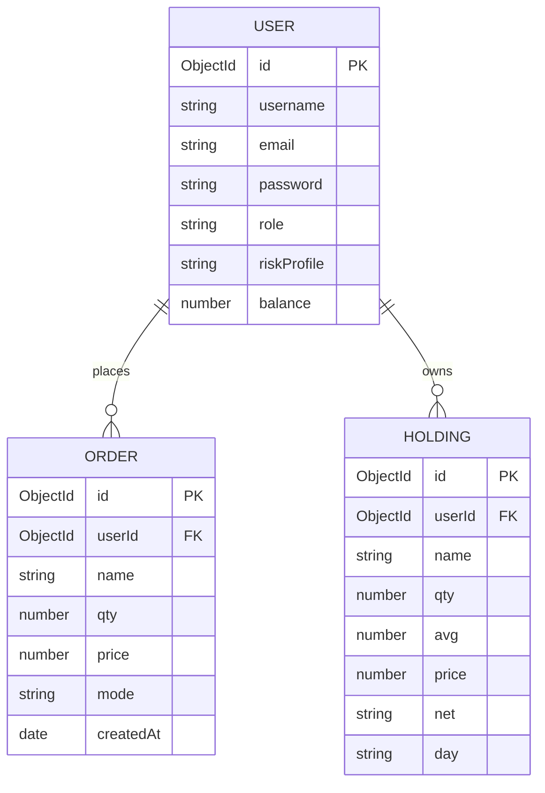

# ApexVest - Production-Grade Trading Platform (Zerodha Clone)

ApexVest is a complete, production-ready full-stack trading web platform inspired by the Zerodha Kite design. It features an interactive user experience, dynamic cash ledgering, realtime portfolio calculations, risk profiling, and a secure JSON Web Token (JWT) session architecture. 

It is designed to showcase clean code patterns, MVC backend structure, state-management flows, database relationships, and real-world business logic during technical reviews and portfolio evaluations.

---

## 🚀 Key Features

* **Full Authentication Flow**: Secure Signup/Login with JWT session management, Bcrypt hashing, persistent cookies (`httpOnly`), and route protection.
* **Database-Driven Balance Ledger**: Live updates to wallet balances during BUY/SELL operations.
* **Order Validation & Guards**: Safeguards to block BUY orders that exceed user balance, and to block SELL orders for assets the user does not own.
* **Weighted Average Cost Calculations**: Real-time updates to stock holdings using weighted average pricing.
* **Visual Portfolios**: Live interactive charts (Doughnut charts for portfolio exposure), dashboard summaries, and structured tables.
* **Modular MVC Backend**: Organized structure dividing controllers, schema definitions, model connections, and modular express routes.

---

## 🛠️ Tech Stack

* **Frontend & Dashboard**: React.js, Tailwind CSS, Material UI, Axios
* **Backend**: Node.js, Express.js, JWT, BcryptJS, Cookie-Parser
* **Database**: MongoDB (Mongoose ODM)
* **Visualization**: Chart.js / React-Chartjs-2

---

## 📁 System Architecture

```text
Zerodha-main/
├── backend/                  # Node.js + Express backend server
│   ├── controllers/          # Business logic handlers (AuthController, OrderController)
│   ├── middleware/           # Token validation & security middlewares
│   ├── model/                # Mongoose Models
│   ├── routes/               # Express REST Route endpoints
│   ├── schemas/              # MongoDB/Mongoose Schema definitions
│   ├── index.js              # Server entry point
│   └── seed.js               # Database seeder script
├── frontend/                 # Client landing page application (React)
│   ├── src/
│   │   └── landing_page/     # Home, pricing, signup, support views
│   └── package.json
└── dashboard/                # Authenticated trading panel application (React)
    ├── src/
    │   ├── components/       # Summary, Holdings, Orders, Funds, Watchlist, Charts
    │   └── data/             # Watchlist dataset & stock metadata
```

---

## 🔧 Database Schema



---

## 🔄 API Routes & Endpoints

### 🔑 Authentication Routes (`/api/auth`)
* `POST /signup` — Register a new account (initializes default ₹1,00,000 balance).
* `POST /login` — Log in to user account (creates JWT HTTP-only cookie).
* `POST /logout` — Clear JWT session cookies.
* `GET /me` — Fetch authenticated profile metadata (including current balance).

### 📈 Trading Routes (`/api/orders`)
* `POST /newOrder` — Execute order. Validates balance and quantity, adjusts MongoDB balance, updates user holdings, and logs orders.
* `GET /allHoldings` — Retrieve all current user holdings.
* `GET /allPositions` — Retrieve user open/closed positions.
* `GET /allOrders` — Get order history log.

---

## ⚙️ Running Locally

1. **Start MongoDB**: Make sure your local MongoDB instance is running at `mongodb://127.0.0.1:27017/zerodha`.
2. **Install & Setup**:
   ```bash
   npm run setup-all
   ```
3. **Seed Templates**:
   ```bash
   npm run seed
   ```
4. **Launch Dev Environment**:
   ```bash
   npm run dev
   ```
   * **Frontend Landing Page**: `http://localhost:3000`
   * **Trading Dashboard**: `http://localhost:3001`

---

## 💡 Quick Interview Q&A Cheatsheet

### 1. How is user authentication preserved across different ports?
The backend enables CORS with `credentials: true` and defines origins for both client ports. Token-based session authentication is handled using a signed JSON Web Token (JWT) sent via an `httpOnly` cookie. This cookie is automatically attached by the browser on all cross-origin requests made via Axios.

### 2. How does the BUY and SELL logic maintain database consistency?
During an order execution (`POST /newOrder`), the backend locks transaction logic:
* For **BUY** orders: It checks the user's available balance in MongoDB. If valid, it decrements the price total, updates the weighted average cost of the stock holding, and appends a record in the orders collection.
* For **SELL** orders: It checks the holdings collection to verify the user owns the asset and has sufficient quantity. If valid, it increments user balance, decrements holdings quantity (deleting the record if quantity reaches 0), and inserts a record into the orders collection.
* All DB changes are executed using mongoose model validations (`await userObj.save()`, `await holding.save()`).

### 3. What calculations are performed for Portfolio metrics?
* **Weighted Average Cost**: `(Old Quantity * Old Average + New Quantity * Purchase Price) / Total Quantity`.
* **Total Investment**: Sum of `(Average price * Quantity)` for all holdings.
* **Current Value**: Sum of `(Current stock price * Quantity)`.
* **Total Profit & Loss (P&L)**: `Current Value - Total Investment`.
